# RecipeBox
### Overview 
RecipeBox is an application that allows users to create, save, edit, organize, and share their favorite recipes. RecipeBox was created as my solo project for Coding Dojo coding bootcamp. My inspiration came from the recipe boxes that were a common kitchen feature of the twentieth century. RecipeBox was built in Visual Studio Code using Python, Django, jQuery, HTML, and CSS.

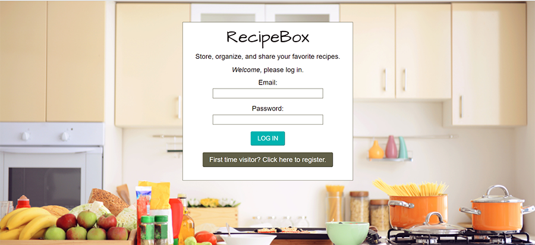

### Features
**Log In / Create Account:** From the homepage, users are able to log in or, if they're a new user, complete a form to create a new account. The form includes validation, including regex email validation, and BCrypt password encryption.

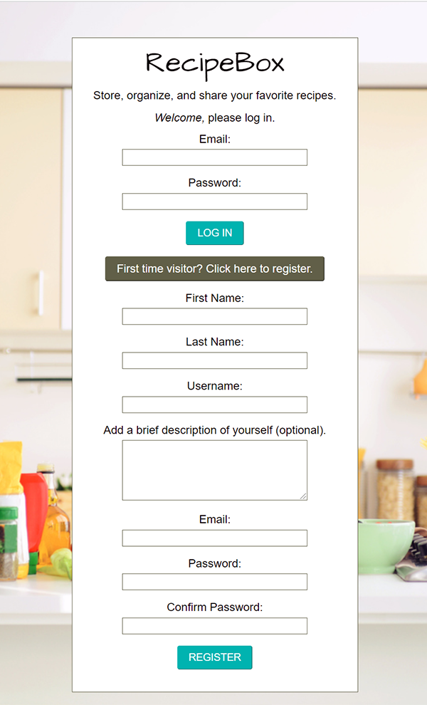

**My Profile:** The My Profile page includes the user's account name and an optional description or bio, as well as their recipe boxes.

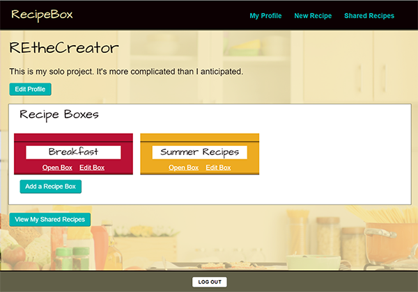

On the My Profile page users can create recipe boxes to store their recipes. When creating a new box, the user adds a name and chooses one of seven color options for the box. Boxes can be edited once they're added.

Clicking on the *Open Box* link displays all of the recipes included in that box.

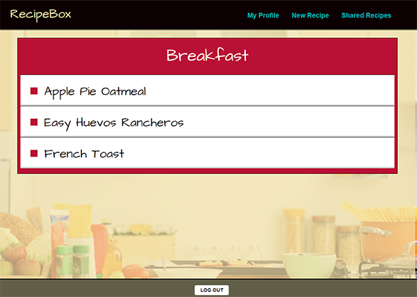

Clicking on the recipe name displays the complete recipe. Recipes are color-coded to match the color chosen for their box.

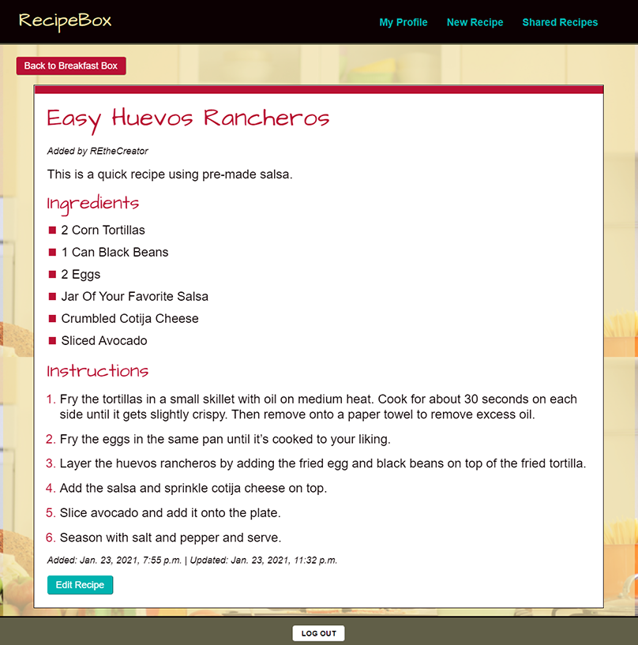

**New Recipe:** Users add a new recipe by clicking on *New Recipe* in the upper navigation bar. A recipe is created in four steps. First, the recipe name and an optional description (or notes) is created.

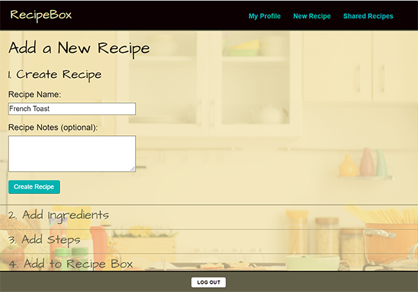

Second, the ingredients are added to the recipe.

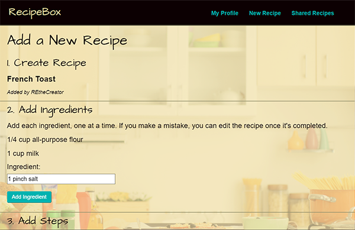

Third, the steps are added to the recipe.

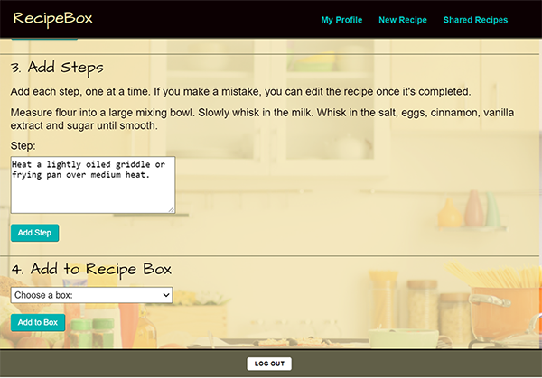

And fourth, a recipe box is chosen to store the recipe from a drop-down menu.

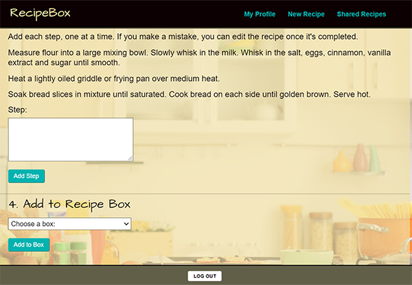

Once completed, a recipe can be edited, including moving it from one box to another.

**Shared Recipes:** A user has the option to share the recipes they've added with other RecipeBox users. From the *Shared Recipes* link in the upper navigation bar, a user can access all the recipes that have been shared. Shared recipes can be seached for by name or ingredient from the search bar.

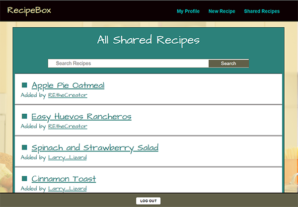

From the Shared Recipes page, a user can view the recipe or the profile of the user who shared that recipe. Clicking on the user's name will diplay their profile along with a list of all the recipes they've shared.

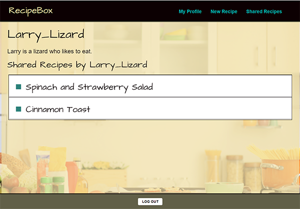

Clicking on the recipe name displays the complete recipe. If the user finds a shared recipe they like, they have the option to add that recipe to one of their own recipe boxes.

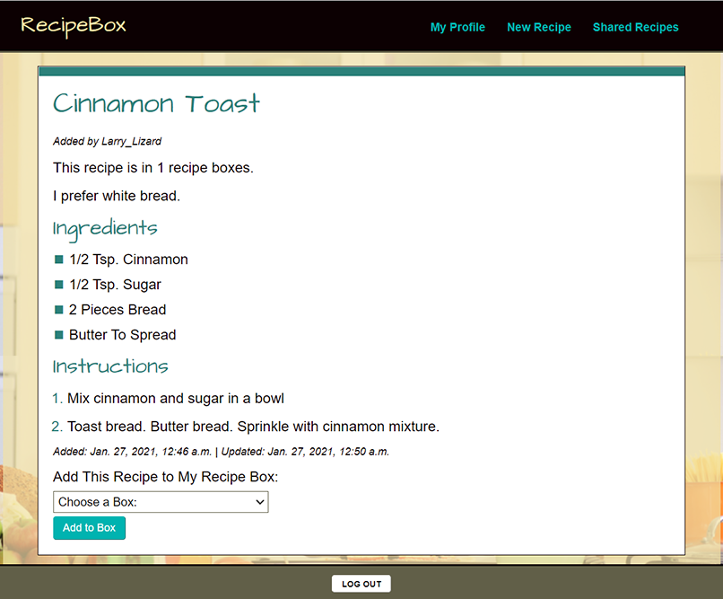

Once added, the shared recipe is accessible to the user from their recipe box.

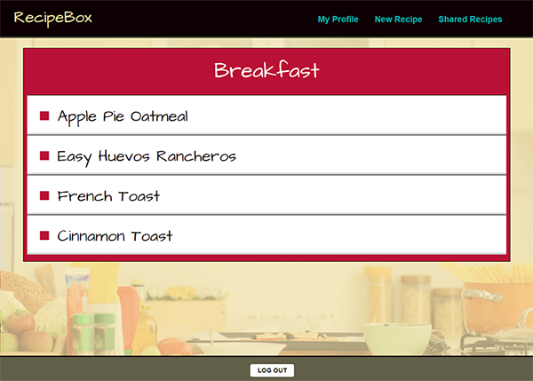

The shared recipe will now display based on the color-coding of its recipe box. Editing priveleges, however, remain only with the user who created the recipe.

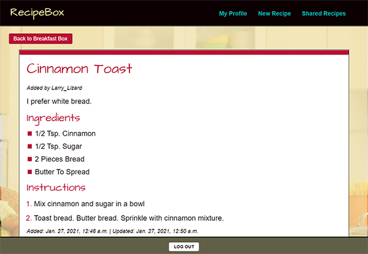

**Responsive:** The layout of RecipeBox is fully resposive for optimal viewing on web, desktop, or mobile devices.

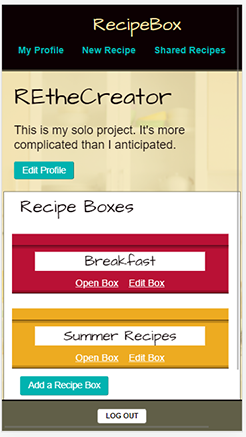

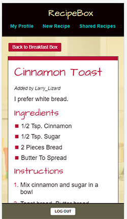
